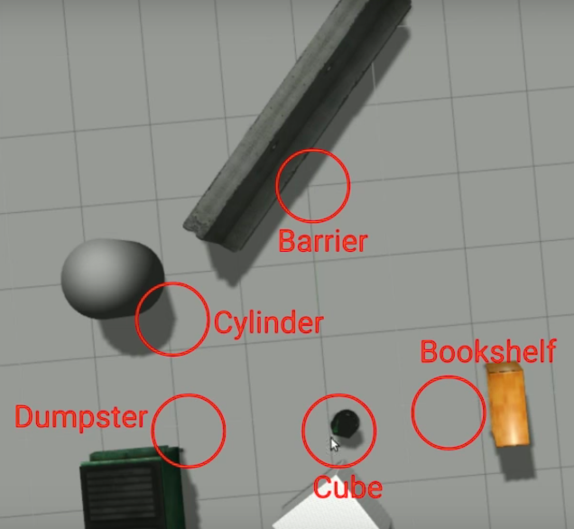
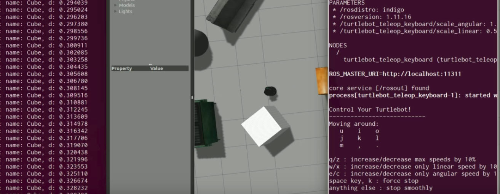
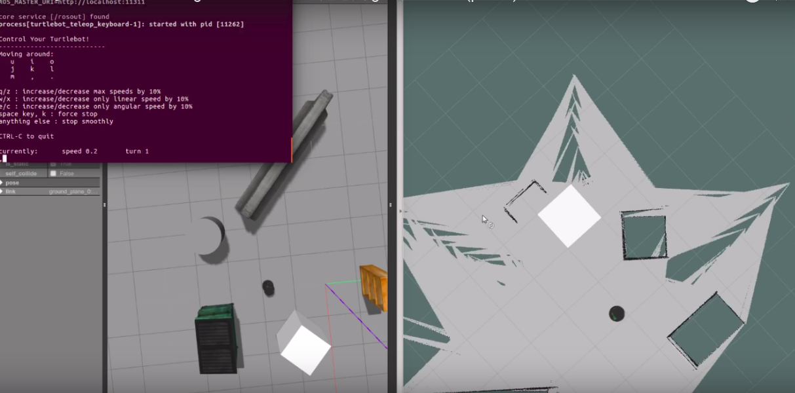

# Robotics Challenge

# Let's start

---

**Kiwi Campus Inc**, the biggest delivery company with robots in Sillicon Valley welcomes you to this new challenge of robotics and machine learning. If you are reading this, you will start in a few minutes the robotics challenge for **Kiwi Campus Inc.**

We will evaluate your abilities of fast learning, synergy, self-learning and quality in the way of solving problems, so take ownership of this and enjoy it!

The challenge consists of a guide on ROS (Robotics operating system) that engineers of **Kiwi Campus Inc** have done with a lot of detail, there you will have to solve step by step simulations, programming tasks and deployment of environments (packages) to complete the challenge, you can find theoretical questions in different points, as well as tests to know your ability using ROS.

Do not forget that ROS has a very large community in the world. Tje ROS's Wiki is the closest way to solve problems and issues. 

## Documentation - ROS

[http://wiki.ros.org/ROS](http://wiki.ros.org/ROS)

# Development Environment.

We recommend to you use an OS (operating system) Linux - Ubuntu 16.04.

## Documentation - Ubuntu 16.04

[http://releases.ubuntu.com/16.04/](http://releases.ubuntu.com/16.04/)

For the robotics challenge, you will have 3 tasks to solve. The 3 tasks have a score of 100 points in total. In Github, there is a repository with .md files with the description of the challenge, where each participant must upload a .bag file for each assignment or when indicated during the challenge guide. The .bag file is obtained using the rosbag ROS tool.

An example of the file name would be:

Indicates a file for task 1

*Task1.bag*

Indicates a file for task 2.1

*Task2_1.bag*

## Repository link - Github

[https://github.com/KiwiCampusChallenge/Kiwi-Campus-Challenge](https://github.com/KiwiCampusChallenge/Kiwi-Campus-Challenge)

## Documentation - Rosbag

[http://wiki.ros.org/rosbag/Tutorials/Recording and playing back data](http://wiki.ros.org/rosbag/Tutorials/Recording%20and%20playing%20back%20data)

# Task 1 - ROS Installation (10 Points)

> Target: Upload a screenshot as shown in the attached image. The username of each participant must appear on the image. The image should show that ROS was installed correctly.

ROS installation - ROS Kinetic

*Requirements*:

Admin access using sudo.

Once installed ROS. In console you can see that it was correctly installed with the following line:

    printenv | grep ROS  

Resources:

Installing and Configuring Your ROS Environment

http://wiki.ros.org/ROS/Tutorials/InstallingandConfiguringROSEnvironment

Navigating the ROS Filesystem

[http://wiki.ros.org/ROS/Tutorials/NavigatingTheFilesystem](http://wiki.ros.org/ROS/Tutorials/NavigatingTheFilesystem)

# Task 2 - Turtlebot Environment (40 Points)

## Task 2.1 - Turtlebot Launch (15 Points)

> Target: Once rosrun stage_ros stageros ra1.cfg is run, create a .bag file with the list of nodes and topics that you are publishing and executing, also the position and speed (linear and angular). The file name must be Task2_1.bag.

Install the world image and save it in the same folder as the ra1.cfg code.

    define topurg ranger
    (
      sensor (
        #range_max [ 0 30 ]
        fov 270.25
        samples 1081
        # generic model properties
        color "black"
        size [ 0.05 0.05 0.1 ]
      )
    )
    
    define erratic position
    (
      size [0.35 0.35 0.25]
      origin [-0.05 0 0 0]
      gui_nose 1
      drive "diff"
      topurg(pose [ 0.050 0.000 0 0.000 ])
    )
    
    define floorplan model
    (
      # sombre, sensible, artistic
      color "gray30"
    
      # most maps will need a bounding box
      boundary 1
    
      gui_nose 0
      gui_grid 0
    
      gui_outline 0
      gripper_return 0
      fiducial_return 0
      #laser_return 1
    )
    
    # set the resolution of the underlying raytrace model in meters
    resolution 0.02
    
    interval_sim 100  # simulation timestep in milliseconds
    
    
    window
    ( 
      size [ 1000.000 638.000 ] 
      scale 30.0
    )
    
    # load an environment bitmap
    floorplan
    ( 
      name "ra"
      bitmap "ra.pgm"
      size [40.0 20.0 1.0]
    )
    
    erratic( pose [ -4.5 -7.0 0.0 45.000 ] name "ra" color "blue")

[ra.pgm](screenshots/ra.pgm)

    rosrun stage_ros stageros ra1.cfg

The map is shown below

## Task 2.2 - Keyboard control - Turtlebot (25 Points)

> Target: Control robot using the keyboard. Create a .bag file with the list of nodes and topics that you are publishing and executing also the position and speed (linear and angular). The file name must be Task2_2.bag.

Resources:

[http://playerstage.sourceforge.net/doc/Stage-3.2.1/index.html](http://playerstage.sourceforge.net/doc/Stage-3.2.1/index.html)

# Task 3 - Are we there yet? - SLAM (60 Points)

## Task 3.1 - Turtlebot Launch (5 Points)

> Target: Crear un archivo .bag con el nombre Task3_1.bag de 30 segundos de duración con la lista de los tópicos y nodos que está corriendo cuando se está manejando el robot con el teclado usando función de teleop.

*Hint: [http://wiki.ros.org/turtlebot_teleop?distro=kinetic](http://wiki.ros.org/turtlebot_teleop?distro=kinetic)*

## Turtlebot Installation

[http://wiki.ros.org/turtlebot/Tutorials/indigo/Turtlebot Installation](http://wiki.ros.org/turtlebot/Tutorials/indigo/Turtlebot%20Installation)

Correr el archivo .launch 

    roslaunch package_name file.launch

    roslaunch turtlebot_gazebo turtlebot_world.launch  

Una vez esté corriendo el .launch se podrá observar un mundo virtual en Gazebo. Un robot Trutlebot, obstáculos y un ambiente en 3D.

## Task 3.2 - Real Time Factor - Gazebo (5 Points)

> Question: ¿Qué significa Real Time Factor?, ¿Qué valor se desea que permanezca cuando se está ejecutando una simulación en Gazebo? ¿Qué significa que esté en ese valor?

> Target: Crear un archivo .md con la respuesta a la anterior pregunta. Éste debe tener como nombre Task3_2.md.

## Task 3.3 - Are we there yet? (20 Points)

> Target: Make the robot print out "I am near the {landmark}" when it enters one of the circled zones. Create a .bag file that contains that information within 30 seconds of time, should be called Task_3_3.bag.

The robot publishes the name and distance to the closest landmark. Using the keyboard to control the robot and create a ROS package called location_monitor that public the Turtlebot pose (X and Y position of the robot).

Target: Make the robot print out "I am near the {landmark}" when it enters one of the circled zones

E.g., "I am near the cube"

Zones are circles with 1 meter diameter.

    rosrun location_monitor location_monitor_node  

We want to have the following results:

When the robot is in certain areas near the object, it must publish what object it is and the distance corresponding to the center of the imaginary circle that was shown in the previous image.

## Task 3.4 - SLAM (30 Points)

> Target: Using the SLAM technique, reconstruct the Gazebo environment. Using Lidar sensor and visualize the data in RVIZ. Create a .bag file with a duration of 1 minute, where RVIZ can be displayed and the Gazebo map with the Turtlebot. The file must have the name Task3_4.bag

